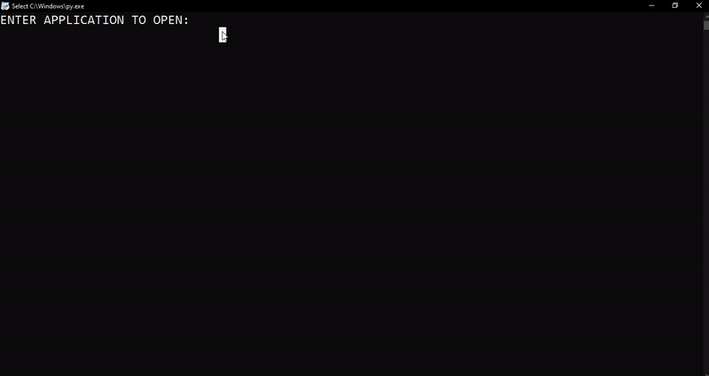

## AppOpener 👏

The AppOpener package is the PYPI module which helps in opening any application **without knowing it's absoulute path**. The module works by making use of <b> App name </b> and <b> App Id </b>

AppOpener works on python version 3.5 or above 3.5+

> **Note**
> This is version of [AppOpener](https://pypi.org/project/AppOpener), is only functional on windows.

Visit official documentation of AppOpener [here](https://AppOpener.readthedocs.io/en/latest/)

The latest development version is always available at the [Github](https://github.com/athrvvvv/AppOpener) repository.

---

> ### Features:

1. Open applications
2. Create list of Apps & Ids

---

### Integrating AppOpener 



---

> ### Install Package 📦

```
pip install AppOpener
```

> ### Quick start ⚡

``` python
from AppOpener import run, mklist
run("telegram, whatsapp")
mklist(name="app_data.json")
```

---
> ### Building package 🔨

```
git clone https://github.com/athrvvvv/AppOpener.git
cd AppOpener
python setup.py sdist bdist_wheel
```
The latest release is always available at the Github [releases](https://github.com/athrvvvv/AppOpener/releases).

---

### Links 🔗

- PYPI page - https://pypi.org/project/appopener/
- Official documentation - https://AppOpener.readthedocs.io/en/latest/
- Github releases - https://github.com/athrvvvv/AppOpener/releases/
- Project changelog - https://github.com/athrvvvv/AppOpener/blob/module/CHANGELOG.md/ 
- Issue tracker - https://github.com/athrvvvv/AppOpener/issues/

### Stay connected 🤝

- [Mail](mailto:athrvchaulkar@gmail.com)
- [Twitter](https://twitter.com/athrvvvvv)
- [YouTube](https://www.youtube.com/c/ACUNBOXING2017)
- [Telegram](https://telegram.me/buddy_join)
